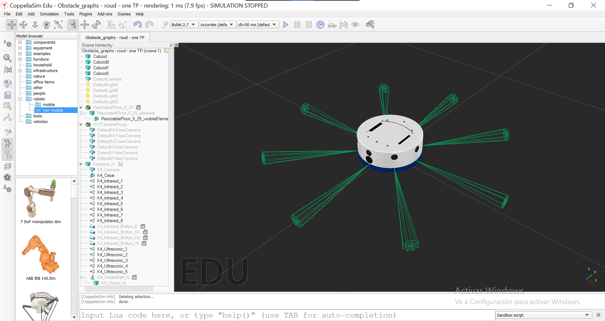
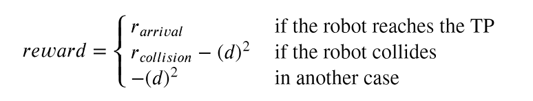

# Gym_Env_Khepera_IV

An [OpenAI Gym](https://gym.openai.com/) Environment for the positional control of the mobile robot Khepera IV in [CoppeliaSim](https://www.coppeliarobotics.com/).

### Description:

The objective of this environment is to drive the wheeled mobile robot from its current position to a predefined target point.

  

This environment corresponds to the implementation of the [Khepera IV library for robotic control education using V-REP](https://www.sciencedirect.com/science/article/pii/S2405896317323303) for the position control experiment (G. Farías et al.).
 

The reward function is defined in a way that, the closer the robot gets to the TP, the reward increases until it becomes zero. In addition, when using the environment to train an agent, collisions are allowed, but they are penalized, adding a negative factor to the reward, in this way the robot learns not to collide with obstacles. Also, when the robot reaches the TP, a positive reward is delivered, rewarding the robot for reaching its goal.

  

Two environments were created with different action spaces, depending on the agent to be used. There is a discrete action space of size 3: turn left, go straight, or turn right. And a continuous set of actions, so that both the linear and angular velocity of the robot can be manipulated. Continuous actions are normalized to obtain better agent behavior, but in the environment, they are mapped to the allowed values of linear and angular velocity.

The observation space for these environments correspond to the distance to the TP which varies between 0 to 1.41 m; the angular error between the orientation of the robot and the TP, with values between -pi and pi; the linear and angular velocity for the previous step; and an arrangement with the measurements of the 8 sensors that the Kephera IV robot has. The sensors take measurements from 0 to 20 cm, but the data is normalized between 0 and 1.

|  Number | Observation                                   |   Minimum  |  Maximum  |
|:-------:|-----------------------------------------------|:----------:|:---------:|
|    0    | Distance to TP                                |      0     |    1.41   |
|    1    | Angular error                                 |     -pi    |     pi    |
|    2    | Linear velocity in previous step              |      0     |    0.05   |
|    3    | Angular velocity in previous step             |   -pi / 4  |   pi / 4  |
| 4 to 12 | Distance measurements from 8 infrared sensors |      0     |     1     |

Each episode ends when the TP is reached, when the maximum number of steps allowed per episode is exceeded, when the robot leaves the maximum allowed area (square side 2 m) or when the robot collides with an obstacle, if any. At the beginning of a new episode, the position of the TP and that of the robot are randomly changed, as is the orientation of the robot. 

Note: gym-khepera position it's a python library that should be installed with the help of a local pip install (pip install -e  gym-kheperaposition)
